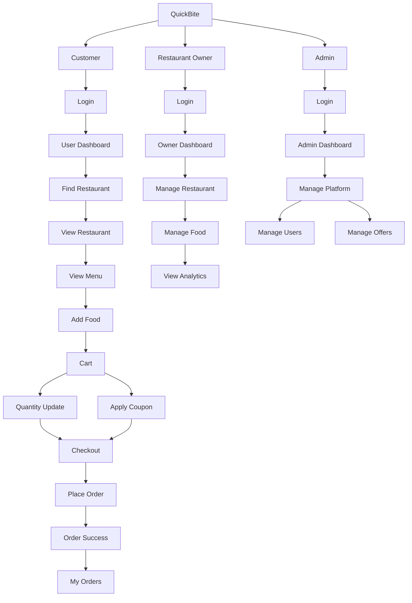
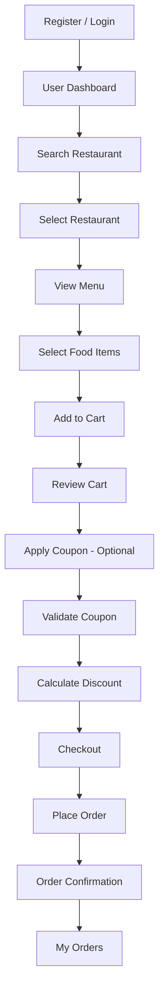
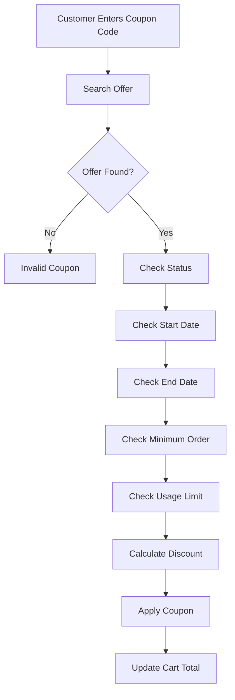
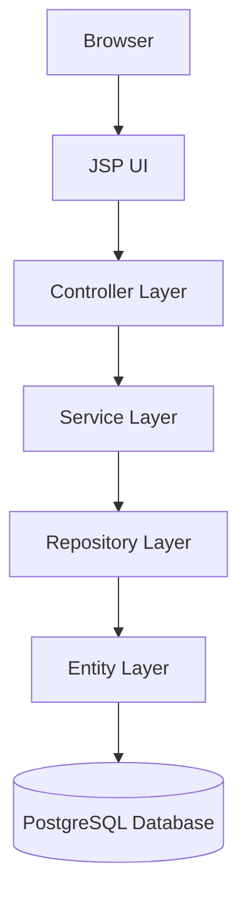
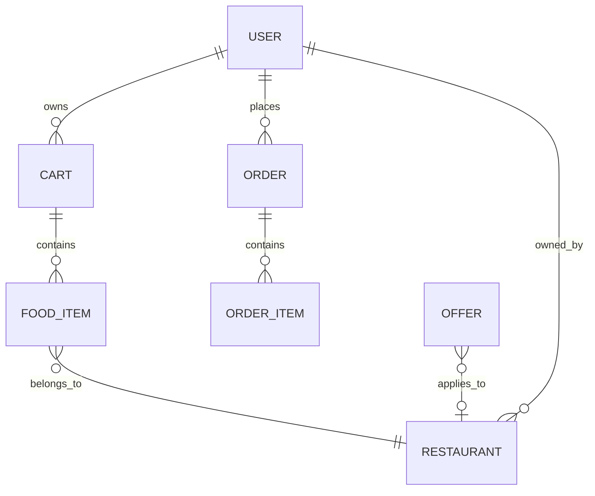
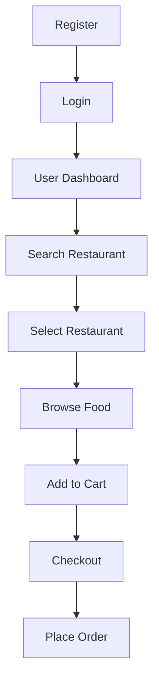
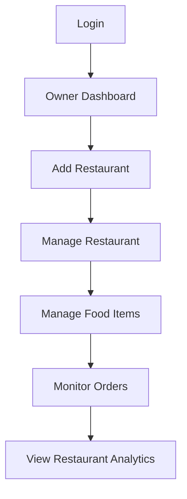
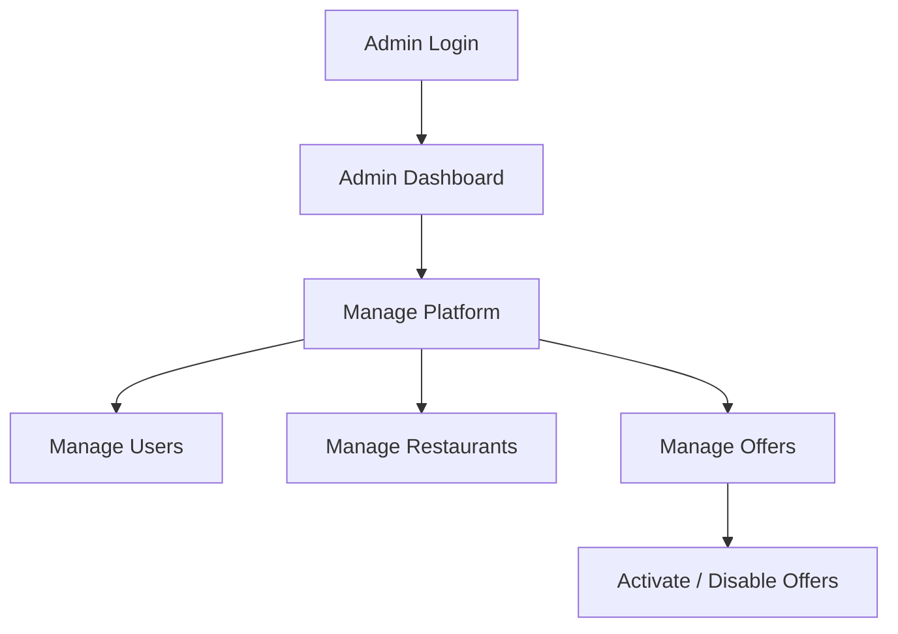

# 🍔 QuickBite — Food Delivery Management System

QuickBite is a web-based food delivery management system that connects **customers**, **restaurant owners**, and **administrators** on a single platform. It brings restaurant discovery, menu browsing, cart management, coupon/offer handling, and order tracking together into one cohesive application.

Built with **Java, Spring Boot, JSP/JSTL, and PostgreSQL**, QuickBite follows a clean, layered architecture and a role-based access model, making it a practical, real-world example of a multi-role web application.

> Discover food. Order easily. Enjoy more.

---

## 📑 Table of Contents

- [Overview](#-overview)
- [Key Features](#-key-features)
- [Application Flow](#-application-flow)
- [User Roles](#-user-roles)
- [Technology Stack](#-technology-stack)
- [Project Architecture](#-project-architecture)
- [Project Structure](#-project-structure)
- [Database Design](#-database-design)
- [Security & Validation](#-security--validation)
- [Getting Started](#-getting-started)
- [Using the Application](#-using-the-application)
- [Screenshots](#-screenshots)
- [Contributing](#-contributing)
- [Future Improvements](#-future-improvements)
- [Project Status](#-project-status)
- [License](#-license)
- [Author / Contributors](#-author--contributors)

---

## 🔎 Overview

Ordering food online typically involves several disconnected steps — finding a restaurant, browsing a menu, managing a cart, applying discounts, placing an order, and tracking order history. QuickBite unifies all of this into one platform, built around three clearly defined roles:

| Role | Responsibility |
|------|-----------------|
| 🧑‍🍳 **Customer** | Search restaurants, browse menus, manage cart, apply offers, place orders |
| 🏪 **Restaurant Owner** | Manage restaurants and food items, monitor orders and revenue |
| 🛠️ **Administrator** | Manage users, restaurants, and platform-wide offers |

The goal is to provide a simple, organized, and user-friendly ordering experience while keeping restaurant and platform management centralized and easy to maintain.

---

## ✨ Key Features

### 🧑‍🍳 Customer Features

- Register for a new account
- Secure login
- Forgot password / reset via **OTP verification**
- Browse and search restaurants (including popular search options)
- View restaurant menus and browse food items
- Filter food items
- Add items to cart, adjust quantities, or remove items
- View cart subtotal and billing breakdown
- Apply, validate, and remove coupon/offer codes
- Checkout and place orders
- View order confirmation and order history (**My Orders**)
- Manage profile, view notifications, and access help/support
- Logout securely

### 🏪 Restaurant Owner Features

- Secure login to a dedicated owner area
- Add and manage one or more restaurants
- Add and manage food items per restaurant
- View restaurant-specific details and order statistics
- Track restaurant revenue
- Access a centralized **Owner Dashboard** for management and basic analytics
- Monitor overall restaurant performance

### 🛠️ Administrator Features

- Centralized **Admin Dashboard**
- User management
- Restaurant management
- Food item management
- Full **Offer Management** module:
  - Create, edit, and delete offers
  - Activate or disable offers
  - Search and paginate offer records
  - Configure discount types and offer types
  - Set validity periods, minimum order value, maximum discount limits, and usage limits
- Monitor platform-level activity

The offer management system allows administrators to run promotional campaigns that customers can later redeem during checkout.

---

## 🔄 Application Flow



### Customer Order Flow



### Coupon / Offer Flow



**Example billing calculation:**

| Item | Amount |
|------|--------|
| Subtotal | ₹800 |
| GST | ₹40 |
| Delivery Charge | ₹40 |
| Coupon Discount | −₹100 |
| **Final Total** | **₹780** |

*The exact discount depends on the offer configured by the administrator.*

---

## 👥 User Roles

| Role | Main Responsibility |
|------|----------------------|
| **Customer** | Browse restaurants, order food, manage cart and orders |
| **Restaurant Owner** | Manage restaurants, food items, and restaurant activity |
| **Admin** | Manage users, offers, and platform-level operations |

This separation keeps customer, restaurant, and administrative responsibilities independent from one another.

---

## 🧰 Technology Stack

**Backend**
- Java
- Spring Boot
- Spring MVC
- Spring Data JPA
- Hibernate
- Maven

**Frontend**
- JSP
- JSTL
- HTML5
- CSS3
- JavaScript
- Font Awesome

**Database**
- PostgreSQL

**Development Tools**
- Spring Tool Suite / Eclipse / IntelliJ IDEA
- Maven
- Git & GitHub
- pgAdmin

---

## 🏗️ Project Architecture

QuickBite follows a standard **layered Spring Boot architecture**:



### Controller Layer
Handles incoming HTTP requests and controls application navigation.
Examples: login requests, restaurant requests, cart operations, order requests, offer management.

### Service Layer
Contains the application's core business logic.
Examples: cart calculations, restaurant operations, order processing, offer validation, discount calculation.

### Repository Layer
Handles communication between the application and PostgreSQL using **Spring Data JPA**.

### Entity Layer
Contains the application's persistent domain objects, including `User`, `Restaurant`, `FoodItem`, `Cart`, `Order`, `OrderItem`, and `Offer`.

---

## 📂 Project Structure

```text
fooddeliverymanagement
│
├── src
│   └── main
│       │
│       ├── java
│       │   └── com.jsp.fdms
│       │       │
│       │       ├── controller
│       │       │   ├── UserController.java
│       │       │   ├── RestaurentController.java
│       │       │   ├── FoodItemController.java
│       │       │   ├── CartController.java
│       │       │   └── OrderController.java
│       │       │
│       │       ├── entity
│       │       │   ├── User.java
│       │       │   ├── Restaurant.java
│       │       │   ├── FoodItem.java
│       │       │   ├── Cart.java
│       │       │   ├── Order.java
│       │       │   └── OrderItem.java
│       │       │
│       │       ├── service
│       │       │   ├── UserService.java
│       │       │   ├── RestaurentService.java
│       │       │   ├── FoodItemService.java
│       │       │   ├── CartService.java
│       │       │   └── OrderService.java
│       │       │
│       │       ├── repo
│       │       │   ├── UsersRepo.java
│       │       │   ├── RestaurentRepo.java
│       │       │   ├── FoodItemRepo.java
│       │       │   ├── CartRepository.java
│       │       │   └── OrderRepo.java
│       │       │
│       │       └── util
│       │           └── PasswordUtil.java
│       │
│       ├── resources
│       │   └── static
│       │       └── css
│       │
│       └── webapp
│           └── WEB-INF
│               └── views
│                   ├── login.jsp
│                   ├── register.jsp
│                   ├── user_dashboard.jsp
│                   ├── restaurant_menu.jsp
│                   ├── cart.jsp
│                   ├── checkout.jsp
│                   ├── order_success.jsp
│                   ├── my_orders.jsp
│                   ├── owner_dashboard.jsp
│                   └── admin_dashboard.jsp
│
├── pom.xml
└── README.md
```

> **Note:** Offer/coupon-related controllers, services, repositories, and entities (e.g. `OfferController`, `OfferService`, `OfferRepo`, `Offer`) follow the same layered pattern shown above and should be placed in their respective packages as the feature is implemented.

---

## 🗄️ Database Design

QuickBite uses **PostgreSQL** as its primary relational database, managed through **JPA/Hibernate**. It stores information related to users, restaurants, food items, cart items, orders, order items, offers, and other application data.



Offers can be associated either with the platform as a whole or with a specific restaurant, depending on how the administrator configures them.

---

## 🔐 Security & Validation

QuickBite includes validation at multiple stages of the user flow:

- Login and registration validation
- OTP-based password reset flow
- Session-based user authentication
- Cart ownership validation
- Coupon code validation
- Offer status, start date, and expiry validation
- Minimum order amount validation
- Offer usage-limit validation

### Coupon Validation Checklist

When a customer applies a coupon, QuickBite verifies:

1. Whether the coupon exists
2. Whether the offer is currently active
3. Whether the offer has started
4. Whether the offer has expired
5. Whether the minimum order amount is satisfied
6. Whether the usage limit has been reached
7. Whether the calculated discount is valid
8. Whether a maximum discount limit has been configured

Only after all checks pass is the coupon applied to the cart.

---

## 🚀 Getting Started

### Prerequisites

Make sure the following are installed before running QuickBite:

- Java JDK 21
- Maven
- PostgreSQL
- Git
- Spring Tool Suite / Eclipse / IntelliJ IDEA
- A modern web browser

Verify your setup:

```bash
java -version
mvn -version
```

### 1. Clone the Repository

```bash
git clone <YOUR_REPOSITORY_URL>
cd fooddeliverymanagement
```

### 2. Configure PostgreSQL

Create a PostgreSQL database:

```sql
CREATE DATABASE quickbite;
```

Update the database configuration in `src/main/resources/application.properties`:

```properties
spring.datasource.url=jdbc:postgresql://localhost:5432/quickbite
spring.datasource.username=YOUR_USERNAME
spring.datasource.password=YOUR_PASSWORD

spring.jpa.hibernate.ddl-auto=update
spring.jpa.show-sql=true
```

> ⚠️ Use your own PostgreSQL username and password. **Do not commit real database credentials to GitHub.**

### 3. Run the Application

Using Maven:

```bash
mvn spring-boot:run
```

Or run the main class directly from your IDE:

```
FooddeliverymanagementApplication.java
```

Once started, open your browser at:

```
http://localhost:8080
```

You'll land on the QuickBite login page.

---

## 🖥️ Using the Application

### Customer



Existing customers can log in directly and continue using the platform.

### Restaurant Owner



### Administrator



---

## 📸 Screenshots

> Screenshots will be added here to demonstrate the major screens of the application.

Recommended folder structure for screenshots:

```text
fooddeliverymanagement/
│
├── screenshots/
│   ├── login.png
│   ├── register.png
│   ├── user-dashboard.png
│   ├── restaurant-menu.png
│   ├── cart.png
│   ├── checkout.png
│   ├── order-success.png
│   ├── my-orders.png
│   ├── owner-dashboard.png
│   ├── admin-dashboard.png
│   └── admin-offers.png
│
├── src/
├── pom.xml
└── README.md
```

GitHub will render images directly from the README using paths such as:

| Screen | Preview |
|--------|---------|
| Login | `` |
| Customer Dashboard | `` |
| Restaurant Menu | `` |
| Cart | `` |
| Checkout | `` |
| Order Success | `` |
| My Orders | `` |
| Owner Dashboard | `` |
| Admin Dashboard | `` |
| Offer Management | `` |

---

## 🤝 Contributing

Contributions are welcome! If you'd like to improve QuickBite or add a new feature, follow the steps below.

### 1. Fork the Repository
Fork the repository to your own GitHub account.

### 2. Clone Your Fork
```bash
git clone https://github.com/ajitmusale3505/QuickBite.git
```

### 3. Create a Feature Branch
```bash
git checkout -b feature/your-feature-name
```
Example:
```bash
git checkout -b feature/order-tracking
```

### 4. Make Your Changes
Implement the feature or fix the issue. Keep changes focused and avoid modifying unrelated parts of the application.

### 5. Test Your Changes
Before opening a pull request:
- Start the application
- Test the affected functionality
- Check existing functionality still works
- Verify database operations
- Check the browser console for frontend errors
- Check the Spring Boot console for backend errors

### 6. Commit Your Changes
```bash
git add .
git commit -m "Add order tracking feature"
```

### 7. Push Your Branch
```bash
git push origin feature/your-feature-name
```

### 8. Open a Pull Request
Open the repository on GitHub and create a Pull Request from your feature branch. In the PR description, include:
- What you changed
- Why the change was needed
- How you tested it
- Any additional configuration required

### Contribution Guidelines

- Keep the existing project structure intact
- Follow the existing naming conventions
- Keep controller logic focused on request handling
- Put business logic inside the service layer
- Use repositories for database access
- Avoid putting database logic directly inside JSP pages
- Never commit passwords or database credentials
- Test existing functionality after making changes
- Keep pull requests focused on one feature or issue where possible
- Add comments only where they improve understanding

---

## 🔮 Future Improvements

- Real-time order tracking
- Online payment integration
- Delivery partner / rider management
- Restaurant ratings and reviews
- Customer notifications (in-app, email, SMS)
- Advanced restaurant analytics
- Delivery management and order status tracking
- Improved admin analytics
- Mobile application
- REST API for mobile clients
- More advanced role and permission management

---

## 💡 Why QuickBite?

QuickBite is built around a simple idea: make food ordering easier for customers while giving restaurant owners and administrators the tools they need to manage the platform effectively.

Instead of treating food ordering, restaurant management, cart management, offers, and order history as separate systems, QuickBite brings them together into one cohesive application — and serves as a practical, real-world example of building a multi-role web application using **Java, Spring Boot, JSP, JPA, and PostgreSQL**.

---

## 📌 Project Status

QuickBite is an **actively developed** food delivery management project. New features, UI improvements, validations, and management functionality are added as the project evolves.

---

## 📄 License

This project is currently intended for **educational and development purposes**. If you plan to use or distribute the project commercially, please add an appropriate open-source or proprietary license.

---

## 👤 Author / Contributors

Developed by:
- Ajit Musale
---

<p align="center"><b>QuickBite</b> — Discover food. Order easily. Enjoy more. 🍔</p>
